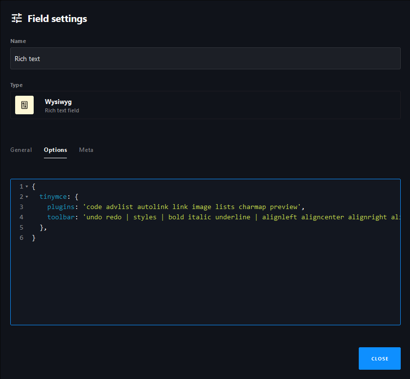

## Pour Coby !

> Attention, j'ai changé la fonction dans index, et les fonctions au début de _menu.php et works.php, pour qu'ils soient plus courts.s

# Base pour un site d'artiste

Voici une base que vous pourrez utiliser pour faire votre propre site grâce à cette formation.

Prend pour exemple un site avec une structure assez simple. 


Les bibliothèques que nous utiliserons sont les suivantes :
- [Cockpit](https://github.com/Cockpit-HQ/Cockpit)
- [PureCSS](https://purecss.io/)
- [DDEV](https://github.com/ddev/ddev)

## Installation
- [Docker](https://www.docker.com/products/docker-desktop/)


### Configuration de Cockpit-HQ

[Lien vers la documentation des différents champs de Cokcpit-HQ](https://getcockpit.com/documentation/core/concepts/fields)

- Ajouter une option pour afficher le code du champ de texte riche de Cockpit-HQ 

Dans les paramètres du champ, aller dans "Options" puis ajouter ce texte : 

```s
{
  tinymce: {
    plugins: 'code advlist autolink link image lists charmap preview',
    toolbar: 'undo redo | styles | bold italic underline | alignleft aligncenter alignright alignjustify | outdent indent bullist numlist | link image code preview ',
  },
}
```




#### FAQ 
`⚠️ En cas d'aperçus d'images qui ne charge pas, essayez d'utiliser un autre navigateur`